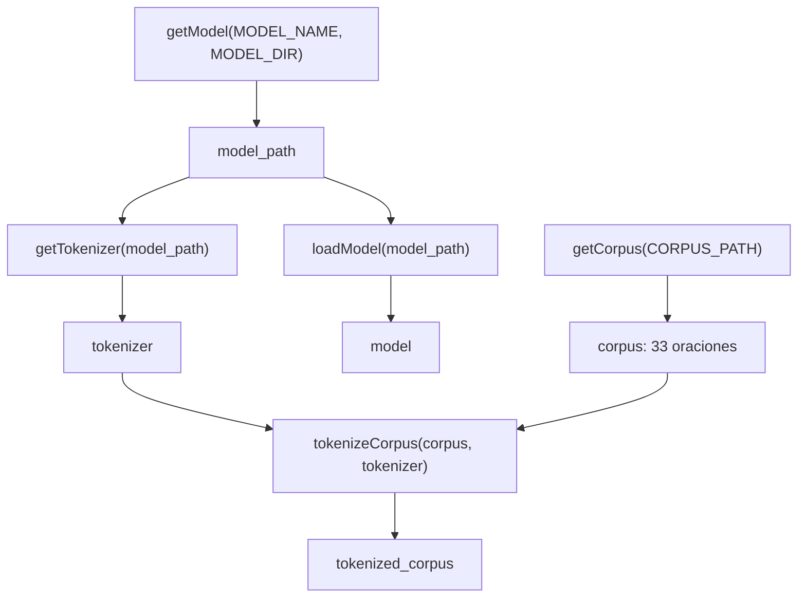

# Funciones auxiliares

[Guía completa del laboratorio](../00-guide.md)

Este documento explica las siete funciones auxiliares del notebook `kafka.ipynb` y la celda de orquestación que las encadena. Las librerías y constantes que usan están explicadas en [Librerías y constantes](./01-librerias-y-constantes.md), y las funciones de cada parte del procedimiento en [Partes A, B, C y D](./03-partes-a-b-c-d.md).

## Panorama

| Función | Entrada | Salida | Responsabilidad |
| --- | --- | --- | --- |
| `getModel` | nombre del modelo, carpeta | `Path` local | Garantizar que el modelo esté en disco |
| `getTokenizer` | ruta local | `BertTokenizerFast` | Cargar el tokenizador |
| `loadModel` | ruta local | `BertModel` | Cargar el modelo en modo inferencia y con atenciones activadas |
| `getCorpus` | ruta del `.txt` | lista de oraciones | Leer el corpus y segmentarlo en oraciones |
| `getTokens` | oración, tokenizador | lista de tokens | Tokenizar incluyendo `[CLS]` y `[SEP]` |
| `tokenizeCorpus` | corpus, tokenizador | lista de diccionarios | Emparejar cada texto con sus tokens |
| `saveResult` | función, nombre, carpeta | `Path` escrito | Volcar la salida de una función a un archivo |

Las primeras tres son de carga, las tres siguientes de datos, y la última es de infraestructura.

## Flujo de dependencias



## `getModel`

```python
def getModel(model_name, model_dir):
    local_path = model_dir / model_name
    config_file = local_path / "config.json"

    if not config_file.exists():
        tokenizer = AutoTokenizer.from_pretrained(model_name)
        model = AutoModel.from_pretrained(model_name)

        tokenizer.save_pretrained(local_path)
        model.save_pretrained(local_path)

    return local_path
```

Su responsabilidad es una sola: devolver una ruta local donde el modelo está garantizado. Implementa una caché manual.

Cómo funciona:

- `model_dir / model_name` arma `models/bert-base-multilingual-cased`.
- Si el archivo `config.json` no está dentro de esa carpeta, descarga desde el Hub de Hugging Face usando `model_name` como identificador remoto, y guarda ambas piezas con `save_pretrained`.
- Si ya está, no hace nada y devuelve la ruta directamente.
- El `return` está fuera del `if`, así que en ambos casos devuelve lo mismo.

Nótese la asimetría deliberada: la descarga usa el **nombre del Hub**, pero lo que devuelve es una **ruta local**. Todo lo que viene después (`getTokenizer`, `loadModel`) carga desde esa ruta local, nunca desde internet.

Qué se gana con esto:

- No se vuelven a descargar cientos de megabytes en cada ejecución.
- Después de la primera vez, el notebook corre sin conexión.
- Reproducibilidad: la versión del modelo queda congelada en disco. Si el repositorio del Hub se actualizara, los resultados no cambiarían.

Lo que queda en la carpeta: `config.json`, `model.safetensors`, `tokenizer.json` y `tokenizer_config.json`.

Por qué la condición mira `config.json` y no la carpeta: validar contra el directorio sería frágil. Si se creara con `mkdir` antes de descargar y la descarga se interrumpiera, la carpeta quedaría creada pero vacía, `local_path.exists()` devolvería `True` en la ejecución siguiente, la función saltaría la descarga y el error aparecería más tarde en `getTokenizer` con un mensaje confuso. Comprobar un archivo que solo existe si la escritura llegó a completarse elimina ese falso positivo. Tampoco hace falta un `mkdir` explícito: `save_pretrained` crea el directorio por su cuenta.

Queda una limitación menor: `.exists()` verifica presencia, no integridad. Si `config.json` se escribiera y el `.safetensors` no, la caché seguiría dando un falso positivo. Para el alcance de este laboratorio la comprobación es suficiente.

## `getTokenizer`

```python
def getTokenizer(model_path):
    return AutoTokenizer.from_pretrained(model_path)
```

Es un envoltorio de una línea. Carga desde la ruta local, no desde el Hub, y devuelve un `BertTokenizerFast` (la clase concreta la resuelve `AutoTokenizer` leyendo `tokenizer_config.json`).

Aunque no añade lógica, tiene valor: mantiene la simetría de nombres con `loadModel` y `getCorpus`, y concentra en un solo lugar el punto donde habría que tocar si más adelante hiciera falta pasar opciones al tokenizador.

## `loadModel`

```python
def loadModel(model_path):
    model = AutoModel.from_pretrained(
        model_path,
        output_attentions=True
    )
    model.eval()
    return model
```

Hace dos cosas, y ambas son necesarias para este laboratorio.

`output_attentions=True` se pasa a `from_pretrained`, lo que significa que queda guardado en `model.config`. Aplica a todas las llamadas posteriores sin repetirlo. Sin esto, `outputs.attentions` sería `None` y no habría nada que analizar: es la línea que habilita toda la Parte B en adelante.

`model.eval()` pone los módulos en modo de evaluación, lo que apaga el dropout. Aquí no es una formalidad: el `config.json` del modelo declara `attention_probs_dropout_prob: 0.1`, es decir, durante el entrenamiento un 10 % de los pesos de atención se anula al azar. Sin `.eval()` ese comportamiento seguiría activo y cada ejecución daría tablas distintas. Es lo que garantiza que los números de `results/` sean reproducibles.

Detalle complementario: `.eval()` no impide que PyTorch construya el grafo de gradientes. De eso se encarga `torch.no_grad()`, que aparece más adelante en `getAttentions`. Son dos mecanismos independientes y en inferencia se usan los dos.

## `getCorpus`

```python
def getCorpus(corpus_path):
    with open(corpus_path, "r", encoding="utf-8") as file:
        raw_text = file.read()

    text = re.sub(r"\s+", " ", raw_text).strip()

    return [
        sentence.strip()
        for sentence in SENTENCE_PATTERN.split(text)
        if sentence.strip()
    ]
```

Lee el archivo y devuelve una lista de oraciones. Son tres pasos.

Primero, la lectura. `encoding="utf-8"` es obligatorio para este texto: sin él, `sábana`, `fácil`, `¿`, `«` y `»` se leerían mal o lanzarían error. El `with` cierra el archivo aunque ocurra una excepción. Se usa `.read()` en lugar de iterar línea por línea porque hay que reconstruir el texto completo antes de poder segmentarlo.

Segundo, la normalización. `re.sub(r"\s+", " ", raw_text)` reemplaza cualquier bloque de espacios, tabulaciones o saltos de línea por un solo espacio. Esto es lo que **une los renglones** del libro en un texto continuo. El `.strip()` final quita los espacios de los extremos.

Tercero, la segmentación. `SENTENCE_PATTERN.split(text)` corta en los límites de oración, y la comprensión de lista descarta los fragmentos vacíos que el `split` pueda dejar.

Resultado sobre `data/corpus.txt`: 33 oraciones.

Por qué no basta con separar por línea: el archivo conserva los saltos de línea de la maquetación del libro, que cortan las oraciones a media cláusula. Leído renglón a renglón, el corpus daría 79 fragmentos sintácticamente incompletos, algunos de dos palabras, y BERT codificaría cada uno de forma aislada. Los patrones de atención de las Partes C y D estarían condicionados por ese recorte arbitrario. Uniendo el texto antes de segmentar, cada elemento es una unidad sintáctica real y el nombre del parámetro `sentence` describe lo que de verdad contiene.

Limitación conocida: la última oración del corpus está incompleta (`... pero donde`), porque el extracto son dos páginas y la frase sigue en la siguiente. Es inherente al recorte del corpus, no al código.

## `getTokens`

```python
def getTokens(sentence, tokenizer):
    encoded = tokenizer(sentence, add_special_tokens=True)
    return tokenizer.convert_ids_to_tokens(encoded["input_ids"])
```

Aquí se llama al tokenizador como función. Eso ejecuta la codificación completa y devuelve un diccionario con `input_ids`, `token_type_ids` y `attention_mask`. Después, `convert_ids_to_tokens` traduce los identificadores de vuelta a las cadenas de los tokens, esta vez **con** los especiales incluidos.

Se puede confirmar en `results/tokenization.txt`: todas las listas empiezan con `[CLS]` y terminan con `[SEP]`.

Conviene contrastar esta forma con `tokenizer.tokenize(sentence)`, que es la alternativa evidente y sería un error usarla aquí: aplica solo la segmentación en subpalabras y devuelve la lista **sin** los tokens especiales. La distinción no es cosmética: la matriz de atención tiene forma `n × n`, donde `n` cuenta también `[CLS]` y `[SEP]`. Para `corpus[5]`, `n` es 44. Si la lista de tokens no incluyera los especiales tendría 42 elementos, y los índices que devuelve `torch.topk` sobre la matriz quedarían desplazados respecto a la lista: las tablas mostrarían el token equivocado. Llamar al tokenizador completo es lo correcto precisamente porque mantiene la alineación entre la lista de tokens y los ejes de la matriz.

Apunte: `add_special_tokens=True` ya es el valor por omisión al llamar al tokenizador. Escribirlo de forma explícita no cambia el comportamiento, pero documenta la intención, que aquí es justamente lo que se quiere dejar claro.

## `tokenizeCorpus`

```python
def tokenizeCorpus(corpus, tokenizer):
    return [
        {
            "sentence": sentence,
            "tokens": getTokens(sentence, tokenizer)
        }
        for sentence in corpus
    ]
```

Recorre el corpus y construye una lista de diccionarios, cada uno con el texto original y su lista de tokens.

Lo importante es que **conserva el texto junto a los tokens**. Ese emparejamiento es lo que permite que la Parte A cumpla lo que pide la guía: mostrar la diferencia entre palabras lingüísticas y tokens del modelo. Con solo la lista de tokens no se podría contrastar contra la forma original.

Llama al tokenizador 33 veces, una por oración. Sería posible tokenizar el corpus completo en una sola llamada por lotes, pero a esta escala la diferencia es imperceptible y el código por elemento es más claro.

El resultado se guarda en `tokenized_corpus` y lo consume `printTokenizedCorpus`.

## `saveResult`

```python
def saveResult(function, log_name, log_dir):
    log_path = Path(log_dir) / log_name
    log_path.parent.mkdir(parents=True, exist_ok=True)

    with open(log_path, "w", encoding="utf-8") as file:
        with redirect_stdout(file):
            function()

    return log_path
```

Es la única función de infraestructura del notebook, y la más interesante desde el punto de vista de diseño.

Recibe una **función**, no un resultado. Esa es la clave: la llamada `function()` tiene que ocurrir dentro del bloque `with redirect_stdout(file)` para que sus `print` se desvíen al archivo. Por eso todas las invocaciones del notebook la envuelven en un `lambda`:

```python
saveResult(
    lambda: printTokenizedCorpus(tokenized_corpus),
    log_name="tokenization.txt",
    log_dir=RESULTS_DIR
)
```

Si se escribiera `saveResult(printTokenizedCorpus(tokenized_corpus), ...)`, Python evaluaría esa llamada **antes** de entrar a `saveResult`: imprimiría todo en pantalla y le pasaría `None`, que no es invocable. El `lambda` retrasa la ejecución hasta el momento correcto.

El resto de las líneas:

- `Path(log_dir)` envuelve el argumento, de modo que la función acepta indistintamente una cadena o un `Path`.
- `.parent.mkdir(parents=True, exist_ok=True)` garantiza que `results/` exista antes de intentar escribir dentro.
- El modo `"w"` trunca el archivo en cada ejecución. Es lo deseable aquí: volver a correr la celda regenera el archivo en lugar de duplicar contenido.
- `encoding="utf-8"` es necesario tanto por los acentos del texto como por los caracteres de las tablas de `tabulate`.
- El `return log_path` es lo que produce las salidas `WindowsPath('results/tokenization.txt')` que se ven bajo esas celdas del notebook: sirven como confirmación de dónde quedó escrito cada archivo.

El patrón que implementa es una separación entre **generar** y **persistir**. Las funciones `printTokenizedCorpus`, `printAttentionShapes` y `printAttentionAnalysis` no saben nada de archivos: solo imprimen. `saveResult` no sabe nada de atención: solo captura. Gracias a eso, cada función de impresión sirve para las dos cosas sin duplicar código: mostrar un ejemplo en el notebook y generar el `.txt` completo de evidencia.

Matiz técnico: al redirigir `sys.stdout` globalmente, cualquier cosa que se imprima ahí dentro termina en el archivo, incluidos avisos de librerías. Los mensajes que se escriben en `sys.stderr` no quedan capturados y seguirán apareciendo en el notebook.

## La celda de orquestación

```python
model_path = getModel(model_name=MODEL_NAME, model_dir=MODEL_DIR)

tokenizer = getTokenizer(model_path)
model = loadModel(model_path)

corpus = getCorpus(corpus_path=CORPUS_PATH)

tokenized_corpus = tokenizeCorpus(corpus, tokenizer)
```

El orden no es arbitrario:

1. `getModel` se ejecuta primero porque `getTokenizer` y `loadModel` dependen de la ruta que devuelve.
2. `getCorpus` es independiente de las anteriores.
3. `tokenizeCorpus` es el único paso que necesita las dos ramas: el corpus y el tokenizador.

Al ejecutarla aparece una barra de progreso `Loading weights: 0/199`, que corresponde a los 199 tensores de pesos que componen el modelo.

Después de esta celda quedan cuatro variables globales que usa el resto del notebook: `tokenizer`, `model`, `corpus` y `tokenized_corpus`.

## Selección de oraciones para las Partes C y D

`getCorpus` devuelve 33 oraciones. Las que analizan las Partes C y D son estas.

Parte C, `corpus[5]`, 44 tokens:

```text
La madre había querido visitar a Gregorio enseguida, pero el padre y la
hermana la habían hecho desistir con argumentos que Gregorio escuchó con
la mayor atención y aprobó por entero.
```

Reúne tres sustantivos de parentesco (`madre`, `padre`, `hermana`) más el nombre propio `Gregorio`, todos como tokens completos del vocabulario, lo que permite usarlos como `target_token` sin tropezar con subpalabras. Los tokens analizados son `madre` (índice 2) y `Gregorio` (índice 8).

`Gregorio` aparece dos veces en esta oración, en los índices 8 y 28, y no son el mismo token para el modelo: son dos filas distintas de la matriz, con representaciones contextuales distintas. La primera está en función de objeto, marcada por la preposición `a`; la segunda es el sujeto de `escuchó`. Por eso `getTopAttention` recibe un parámetro `occurrence` y las tablas de `results/` imprimen `Ocurrencias del token` e `Índice analizado`: la fila examinada queda registrada en la propia evidencia, sin depender de una nota externa.

Parte D, `corpus[5]` frente a `corpus[21]`:

```text
Gregorio había bajado la sábana más que de costumbre, de modo que formara
abundantes pliegues y pareciera que estaba allí por causalidad.
```

El contraste es de función sintáctica sobre la misma forma superficial: `Gregorio` aparece en `corpus[5]` como objeto marcado por la preposición `a` (índice 8) y en `corpus[21]` como sujeto en posición inicial (índice 1). Es lo que la guía pide comparar, con la variable de la palabra controlada.
